

# 🛍️ Smart Shop

### ML-Powered Purchase Intent Prediction & Personalized Discount Engine

[Live Demo](https://smart-shop-purchase-prediction-p6tfv7q3mapppmrshjjqkut.streamlit.app/)· [Dataset](data/shop_smart_ecommerce.xls) · [Report Bug](../../issues) · [Request Feature](../../issues)

---

## 📌 Overview

**Smart Shop** is a machine learning system that predicts whether an online shopper is likely to make a purchase — using behavioral signals like the number of pages visited, time spent per page category, and the current month — and uses that prediction to personalize the user experience in real time.

When the model identifies a high-intent visitor, Smart Shop can trigger a **small, targeted discount** to nudge them toward conversion, turning raw browsing behavior into a smarter, more personalized shopping journey.

---

## 📊 Dataset

The dataset contains **~12,330 samples** and **18 features** (17 input features + 1 target: `Revenue`), capturing user session behavior across an e-commerce site — including page visit counts, time spent on administrative/informational/product-related pages, bounce and exit rates, and seasonal/traffic metadata.

| Attribute | Details |
|---|---|
| Samples | ~12,330 sessions |
| Input Features | 17 |
| Target Variable | `Revenue` (purchase: Yes/No) |
| Class Balance | ~15.5% positive (purchased) |

**Feature Reference:**

| Feature | Description |
|---|---|
| `Administrative` | Number of pages visited related to account management (login, profile, etc.) |
| `Administrative_Duration` | Total time (in seconds) spent on administrative pages |
| `Informational` | Number of informational pages visited (FAQ, policies, etc.) |
| `Informational_Duration` | Total time (in seconds) spent on informational pages |
| `ProductRelated` | Number of product-related pages visited |
| `ProductRelated_Duration` | Total time (in seconds) spent on product-related pages |
| `BounceRates` | Percentage of visitors who leave the site after viewing only one page |
| `ExitRates` | Percentage of exits from a given page |
| `PageValues` | Average value of pages visited before completing a transaction |
| `SpecialDay` | Closeness of the visit date to a special day (e.g., Valentine's Day, Mother's Day) |
| `Month` | Month of the visit (Feb, Mar, May, etc.) |
| `OperatingSystems` | Operating system used by the visitor (encoded) |
| `Browser` | Browser used by the visitor (encoded) |
| `Region` | Geographic region of the visitor (encoded) |
| `TrafficType` | Source of traffic (e.g., direct, referral, ads) |
| `VisitorType` | Type of visitor — `Returning_Visitor`, `New_Visitor`, or `Other` |
| `Weekend` | Whether the visit occurred on a weekend |
| `Revenue` | **Target variable** — whether the visitor made a purchase |

**Class Distribution:**

  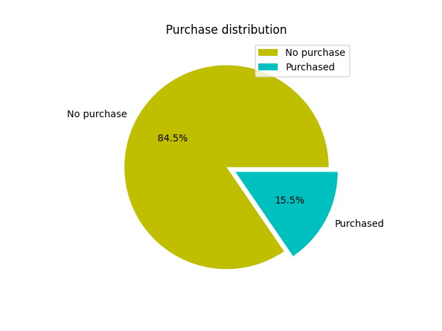

<!-- ⬆️ Upload "Revenue_Distribution" (pie chart) here as: assets/revenue_distribution.png -->

---

## 🔍 Exploratory Data Analysis — Key Findings

- Only **15.5%** of all users in the dataset completed a purchase — a notably imbalanced target.
- Purchase probability rose sharply as **bounce rate decreased**.
- Users with a **lower exit rate** were significantly more likely to convert.
- Sessions from **Traffic Types 1–4** converted at a higher rate than other traffic sources.
- **November** and **May** recorded the highest sales volume — purchase probability increased notably during these months.
- **Returning visitors** converted more often than new visitors.
- Higher **`PageValues`** correlated directly with an increased likelihood of purchase.
- A disproportionate share of purchases occurred on **special days** (e.g., Mother's Day and similar events).

<table>
  <tr>
    <td>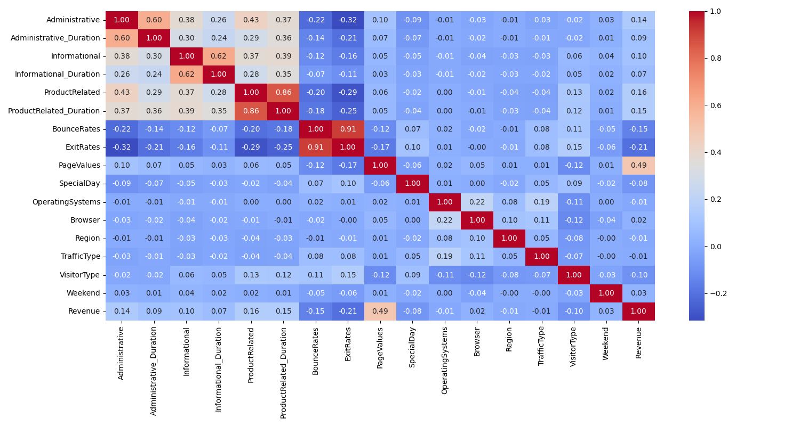</td>
    <td>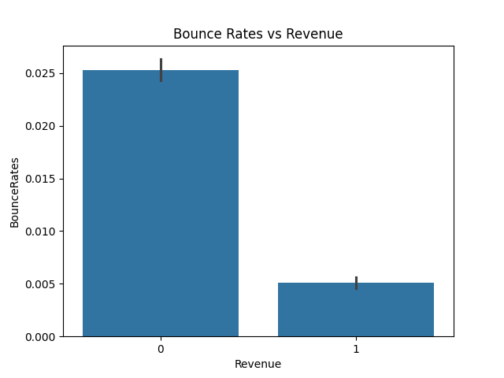</td>
  </tr>
  <tr>
    <td>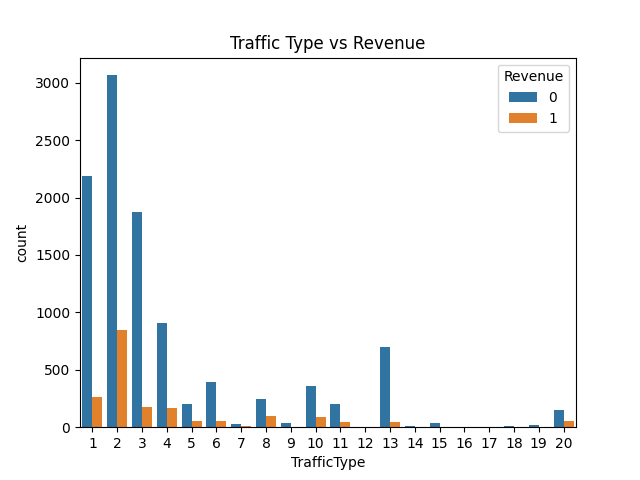</td>
    <td>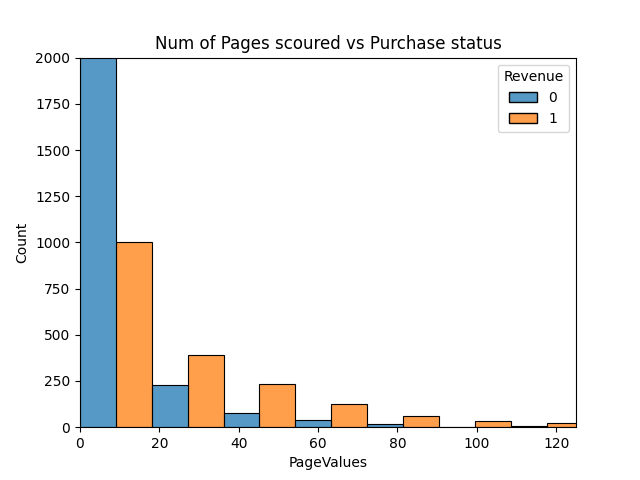</td>
  </tr>
  <tr>
    <td colspan="2" align="center">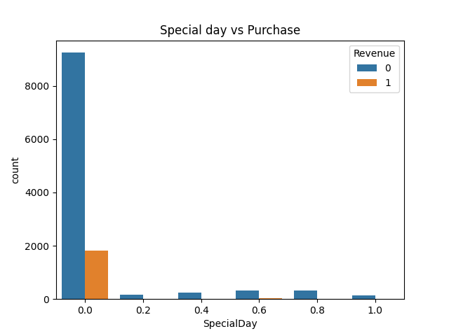</td>
  </tr>
</table>
<!-- Upload these 5 EDA charts with these exact filenames into assets/:
     correlation_heat_map                 → assets/correlation_heatmap.png
     bounce_rates_vs_revenue              → assets/bounce_rate_vs_revenue.png
     traffic_type_vs_revenue              → assets/traffic_type_vs_revenue.png
     pages_visited_vs_revenue_dist        → assets/pagevalues_vs_revenue.png
     special_day_revenue_distribution     → assets/special_day_vs_revenue.png -->

---

## 🧹 Preprocessing

The following steps were applied to prepare the data for modeling:

1. **Type conversion** — Boolean fields (`Weekend`, `Revenue`) were cast to integers.
2. **Ordinal mapping** — `VisitorType` was mapped to `{0, 1, 2}` based on its relative importance to purchase behavior.
3. **Feature grouping** — Numerical (`num_cols`) and categorical (`cat_cols`) columns were separated and stored for pipeline construction.
4. **Unified pipelines** — Identical preprocessing pipelines were built for all three candidate models:
   - **Scaling** numerical features
   - **One-Hot Encoding** categorical features

This ensured a fair, consistent comparison across all models during evaluation.

---

## 🤖 Models Compared

Three classifiers were trained and benchmarked: **Logistic Regression**, **Support Vector Machine (SVM)**, and **Decision Tree**.

Since Smart Shop's core objective is to *identify likely buyers and personalize their experience*, the priority metric was **Recall** — minimizing false negatives (actual customers misclassified as "won't buy") was more valuable than raw accuracy, since a missed high-intent customer is a missed conversion opportunity.

Hyperparameter tuning was performed across all three models, including class-weight balancing, to optimize this trade-off between precision and recall.

### 📈 Evaluation Metrics

| Model | Class Weight | Accuracy | Precision | Recall | F1 |
|---|---|---|---|---|---|
| Logistic Regression | None | 87.99% | — | — | 0.480 |
| Logistic Regression | Balanced | 87.97% | 0.5997 | 0.668 | 0.632 |
| SVM | None | 88.75% | — | — | 0.559 |
| SVM | Balanced | 86.52% | 0.516 | 0.760 | 0.615 |
| **Decision Tree** | None | 89.46% | 0.701 | 0.554 | 0.619 |
| **Decision Tree** | Balanced | 82.48% | 0.4641 | **0.860** | 0.603 |

> 🏆 **Decision Tree (Balanced)** was selected as the final model — it achieved the highest recall (**86%**), aligning best with the business goal of catching as many genuine buyers as possible, even at some cost to precision.

**Confusion Matrices:**

<table>
  <tr>
    <td align="center"><b>Decision Tree</b> 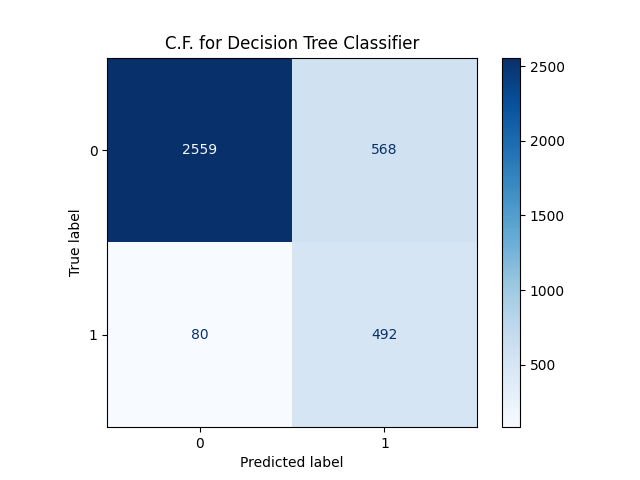</td>
    <td align="center"><b>Logistic Regression</b> </td>
    <td align="center"><b>SVM</b> 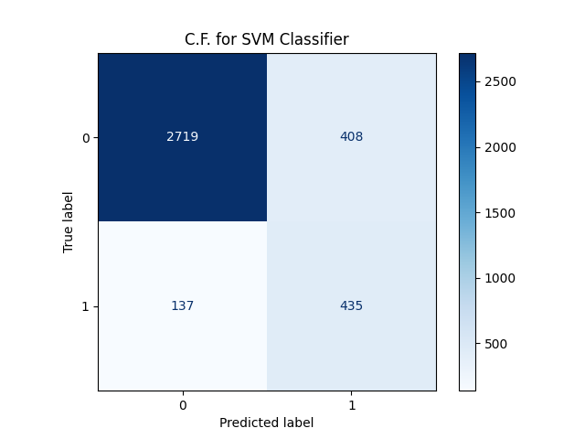</td>
  </tr>
</table>
<!-- Upload these 3 side by side with these exact filenames into assets/:
     cf_decision_tree      → assets/cf_decision_tree.png
     cf_lr                 → assets/cf_logistic_regression.png
     cf_svm_classifier     → assets/cf_svm.png -->

---

## 🧠 Feature Importance

- **Month_Oct**
- **ExitRates**
- **Administrative**
- **Month_May**
- **Month_Mar**
- **BounceRates**
- **Month_Sep**
- **ProductRelated_Duration**
- **Month_Nov**
- **PageValues**

---

## 💡 Business Insights

- **Returning visitors convert more often than new visitors** — loyalty and familiarity drive purchase behavior.
- **Higher `PageValues` strongly correlate with purchases** — this is one of the strongest predictive signals in the dataset.
- **Certain traffic sources convert far better than others** — marketing spend could be reallocated toward high-converting channels.
- **High exit rates are a strong negative signal** — visitors who exit quickly rarely purchase.
- **Seasonality matters** — some months (notably November and May) show significantly better conversion, useful for planning promotional campaigns.

---

## 🖥️ Application Preview

The trained model is deployed via an interactive **Streamlit** app that predicts purchase intent in real time and personalizes the user's discount offer accordingly.

<table>
  <tr>
    <td align="center">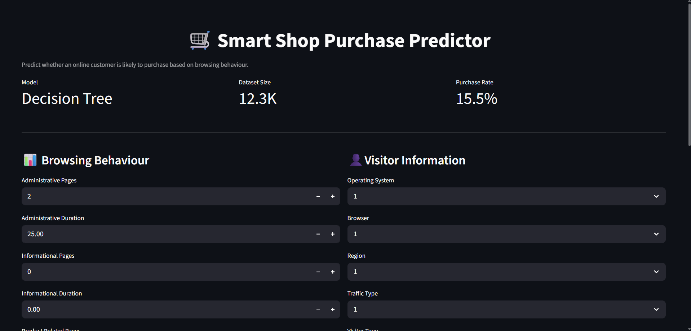</td>
    <td align="center">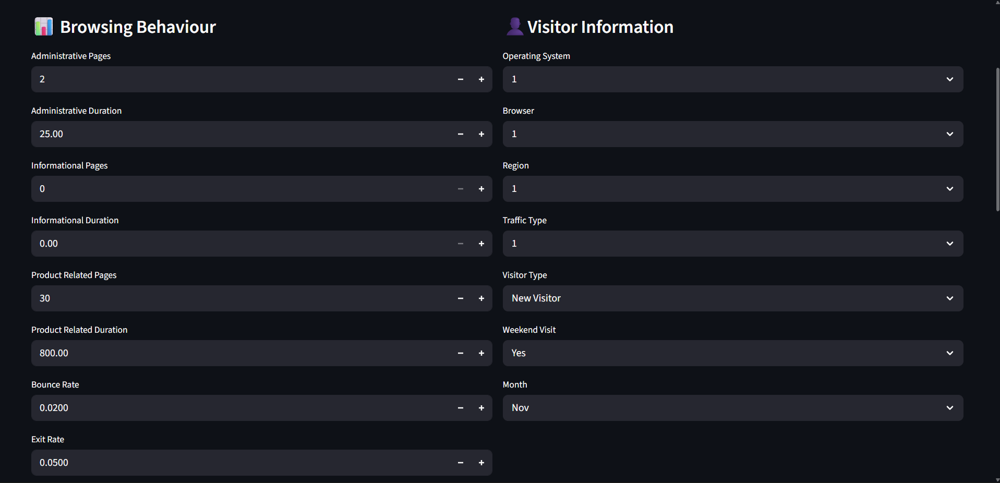</td>
  </tr>
  <tr>
    <td align="center">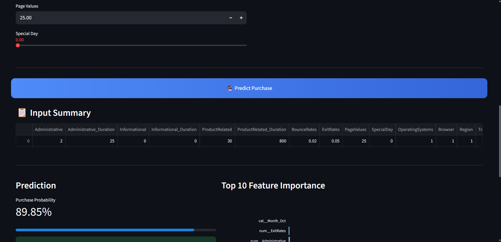</td>
    <td align="center">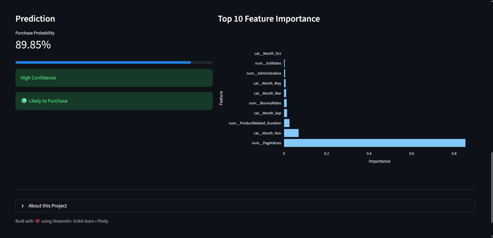</td>
  </tr>
</table>
<!-- Upload your 4 app screenshots with these exact filenames into assets/:
     app_ui_1 → assets/app_ui_1.png
     app_ui_2 → assets/app_ui_2.png
     app_ui_3 → assets/app_ui_3.png
     app_ui_4 → assets/app_ui_4.png
     (Order them so they read top-left → bottom-right as: input form → filled form → prediction result → discount output) -->

---

## 📄 License

This project is licensed under the **MIT License** — see the [LICENSE](LICENSE) file for details.

---

Made with ☕ and a lot of `pandas.groupby()`

